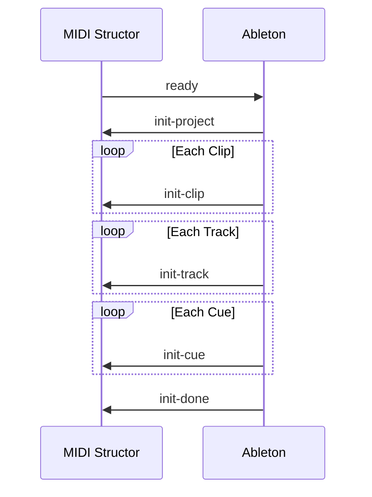
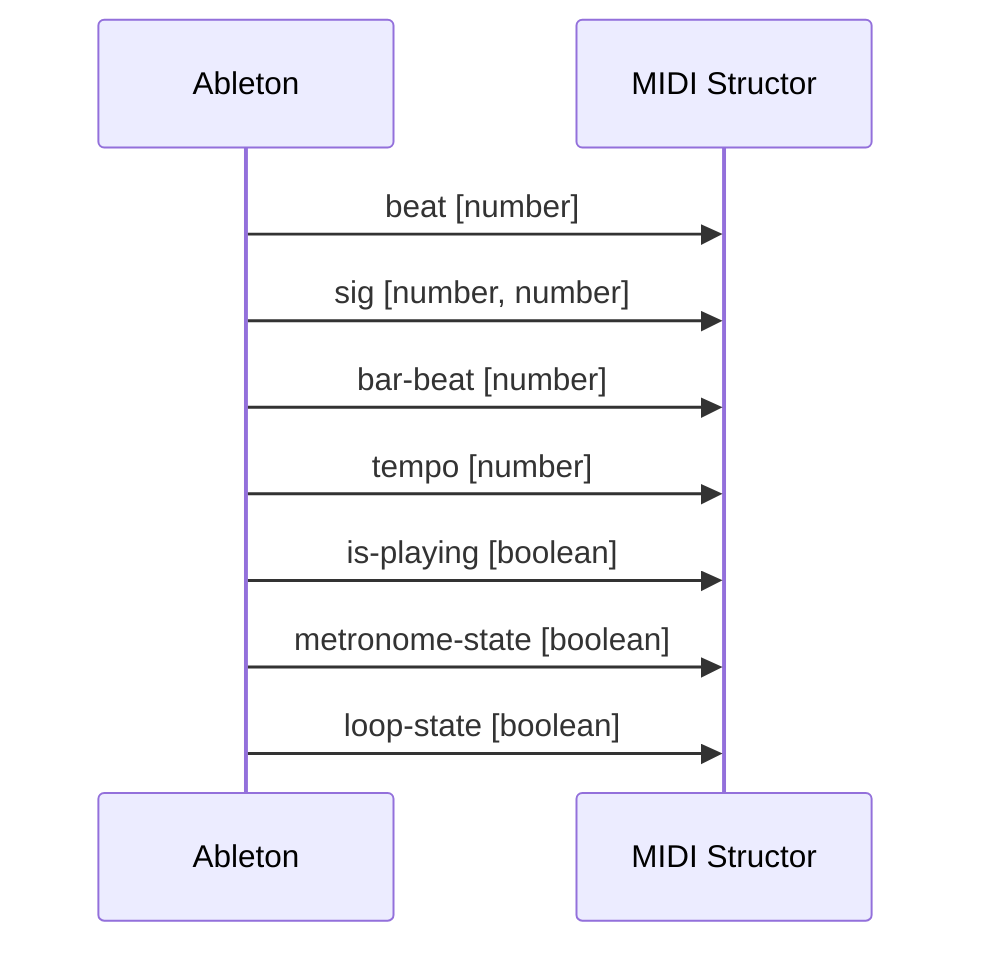
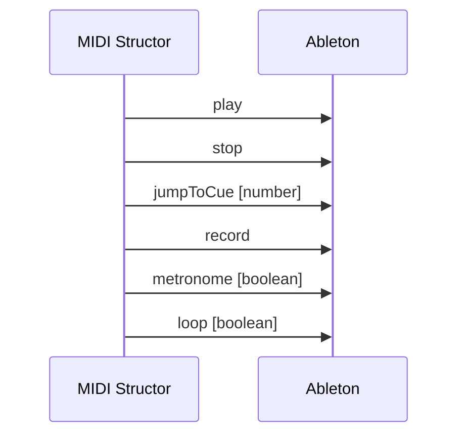

# Installing a node package to a submodule
```
pnpm --filter @midi-structor/core i promise-worker
```

https://docs.cycling74.com/legacy/max8/vignettes/live_object_model

## This project uses `turborepo` and `pnpm`

Prereqs:
```
nvm use
pnpm install
```

Running web app locally:
```
./run.sh
```

Building electron, including bundling the ui:
```
./electron-make.sh
```

Making MacOSX icons
```
brew install makeicns
makeicns -512 midi-structor-logo-512.png
```

Initialize Messages


Real Time Messages


Control Messages

